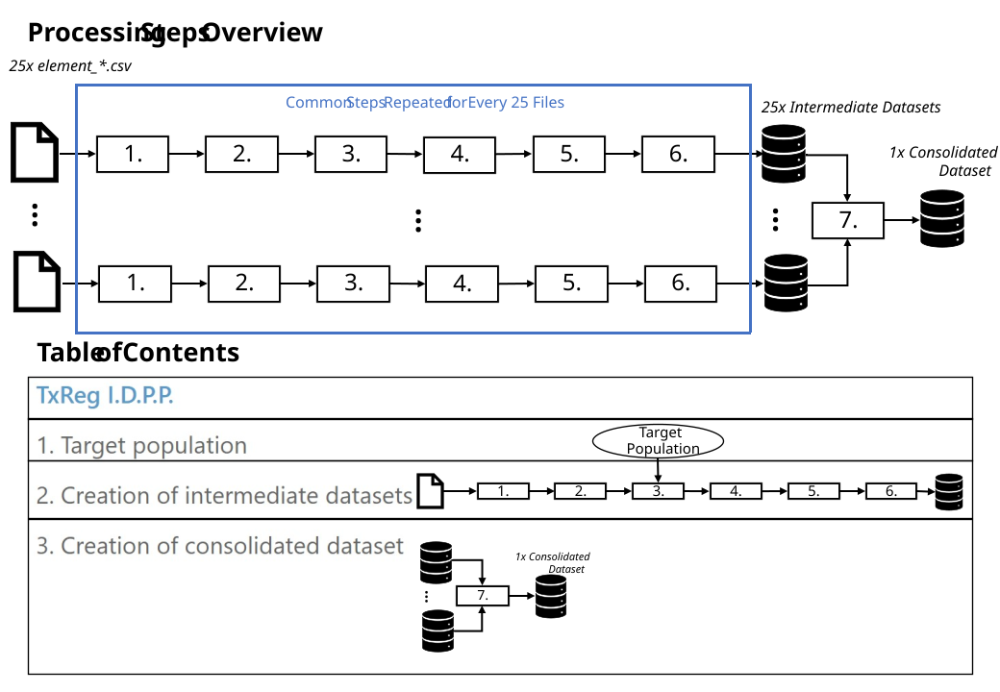

# TxReg I.D.P.P

The inital data preprocessing pipeline (I.D.P.P.) is a result of the
{term}`IDEN` project.
It uses the data from the {term}`TxReg` data export for kidney transplantations
and performs preprocessing to produce a {term}`consolidated dataset` for the
use in research.
We aimed to achieve three goals with the pipeline: **Usability of the data**,
**transparency of the processing** and **initial data analysis**.

```{note}
Data on living donors is currently not being used.
```

For each relevant input `element_NAME.csv` file, an
{term}`intermediate, processed dataset` is produced. Then, these are combined
to the {term}`consolidated dataset`. Documentation of
the processing steps and the datasets are available in
[](./02_preprocessing/index.md).



```{warning}
The pipeline was developed and tested with a data export performed on the 11th
of  Feburary 2022. Newer exports may introduce breaking changes.
```

## Table of contents

```{tableofcontents}
```

## Glossary

```{glossary}
IDEN
  Abbreviation of "Ein interdisziplinärer Data-Science-Prozess zur effektiven
  Nutzbarmachung medizinischer Register- und Studiendaten".

TxReg
  The [German national registry for organ
  transplantation](https://transplantations-register.de/).

consolidated dataset
  The final output of the pipeline. A single table were each row represents
  a single transplantation. 

intermediate, processed dataset
  Result of the preprocessing of each input file. 

institutions
  Data is provided to the registry by {term}`ET`, {term}`IQTIG` and {term}`DSO`.

ET
  [Eurotransplant](https://www.eurotransplant.org/)

IQTIG
  [Institut für Qualitätssicherung und Transparenz im
  Gesundheitswesen](https://iqtig.org/)

DSO
  [Deutsche Stiftung Organtransplantation](https://dso.de/)
```
